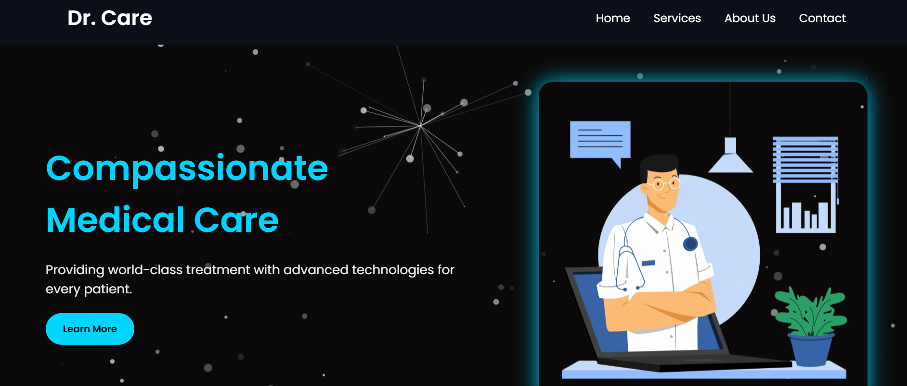

# 🏥 Doctor Landing Page – Dr. Care

A modern, fully responsive **Doctor or Hospital Landing Page** built using **HTML, CSS, and JavaScript**. It’s ideal for clinics, private practices, health tech startups, or medical professionals who want to showcase their services online with style and interactivity.

---

## 🔗 Live Demo

🌐 **Visit Now** → [https://abbas-devloper.github.io/Doctor/](https://abbas-devloper.github.io/Doctor/)

---

## 📸 Screenshots

| Desktop View | Mobile View |
|--------------|-------------|
|  |  |

> *Replace the above image links with your actual screenshots.*

---

## ✨ Key Features

- ✅ Clean and professional design
- ✅ Responsive layout for all devices
- ✅ Animated **hamburger menu**
- ✅ **Spline 3D Robot** integration in the About section
- ✅ Stylish **glassmorphism** Services section
- ✅ Smooth scroll and transitions
- ✅ Functional **contact form** via FormSubmit
- ✅ Easy-to-customize and SEO-friendly code

---

## 🚀 Technologies Used

- HTML5
- CSS3 (Media Queries, Glassmorphism, Animations)
- JavaScript
- [Spline 3D](https://spline.design/)
- [FormSubmit](https://formsubmit.co/) – for form handling
- Optional: [Swiper.js](https://swiperjs.com/) – for sliders (if used)

---


---

## 🧠 How to Use

1. Clone this repository:

   ```bash
   git clone https://github.com/Abbas-Devloper/Doctor.git

## 👨‍💻 Author

**Muhammad Abbas Soomro**  
💼 Front-End Developer | UI/UX Enthusiast  
📧 [Email Me](mailto:soomromuhammadabbas671@gmail.com)  
🐙 [GitHub – Abbas-Devloper](https://github.com/Abbas-Devloper)

